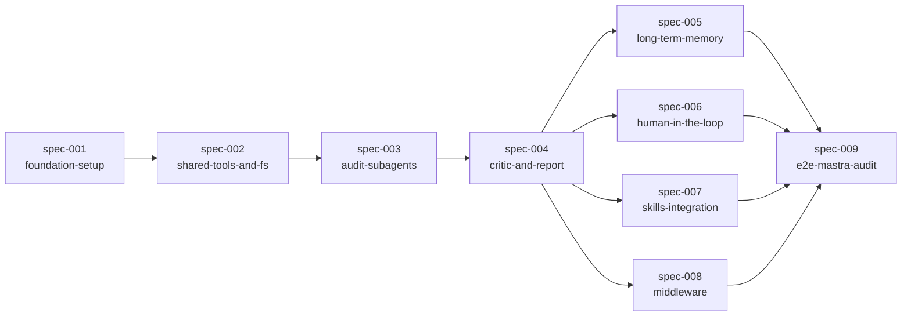

# Dependencies — Mastra 監査エージェント MVP

## Dependency Graph

## Implementation Order

| Order | Specification | Depends On | Why This Order | Notes |
|-------|---------------|------------|----------------|-------|
| 1 | spec-001-foundation-setup | none | TypeScript 雛形と deepagents の最小動作確認を土台にする | 地雷確認を最優先 |
| 2 | spec-002-shared-tools-and-fs | spec-001 | サブエージェント群で共有するツールと FS レイアウトを先に固める | |
| 3 | spec-003-audit-subagents | spec-002 | 5 観点の監査サブエージェントを並列実装（license / security / maintenance / api-stability / community） | 各観点の raw データフォーマットを揃える |
| 4 | spec-004-critic-and-report | spec-003 | 監査結果を統合してレポート化する。critic が一段入ることでファクトチェックが成立する | この時点で MVP の "動くもの" が完成 |
| 5 | spec-005-long-term-memory | spec-004 | 動く土台に長期メモリを後付けする | 5〜8 は Deep Agents の機能追加レイヤで、並行実装可能 |
| 6 | spec-006-human-in-the-loop | spec-004 | HITL を必然性のあるツール（外部 API / レポート書き込み）に適用する | |
| 7 | spec-007-skills-integration | spec-004 | 監査観点とレポート文体を Skills に外出しする | |
| 8 | spec-008-middleware | spec-004 | ツール呼び出しロギングとレート制限を Middleware で差し込む | |
| 9 | spec-009-e2e-mastra-audit | spec-005, 006, 007, 008 | 全機能を統合した状態で Mastra を対象に E2E 実行し、最終レポートを生成する | Zenn 記事のハイライト |
